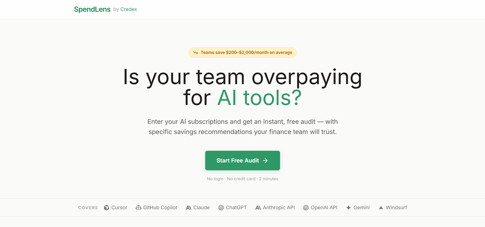
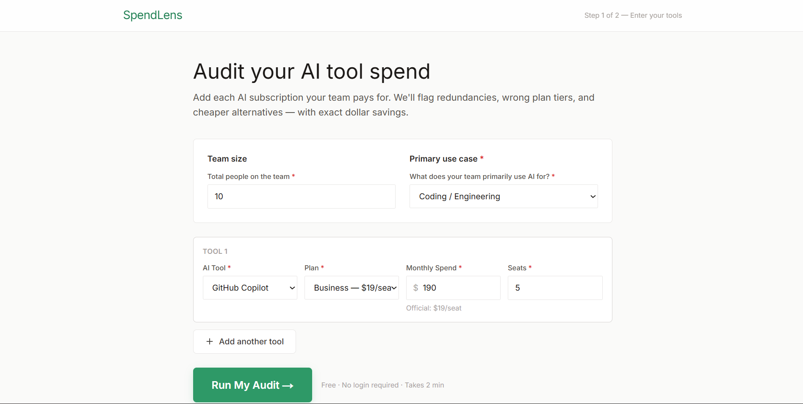
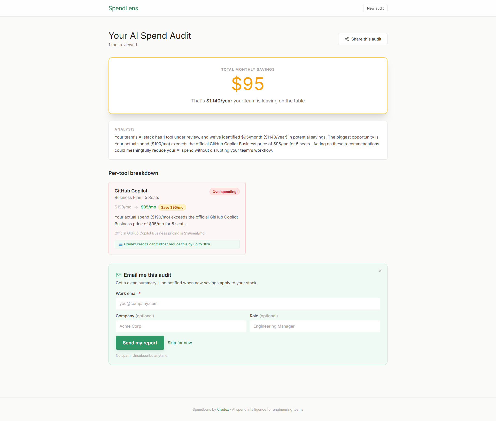

# SpendLens - AI Tool Spend Auditor

SpendLens audits your team's AI subscriptions - Cursor, Copilot, Claude, ChatGPT, and more - and returns specific, dollar-quantified savings recommendations in under 2 minutes. Built for engineering team leads and CTOs who are paying for AI tools but are not sure if they are on the right plans.

Live URL: https://credexspendlens.vercel.app

---

## Visual Overview

### Landing Page


### Audit Form


### Results Dashboard


---

## Technical Documentation Index

To support development, architecture review, and go-to-market strategies, the following core documents are included directly within this repository:

### Engineering & Architecture
* [Database Schema Definition (SCHEMA.sql)](SCHEMA.sql) - Production DDL layout, performance indices, and constraint setups for Supabase.
* [Backend Structure Specification](docs/BACKEND_STRUCTURE.md) - Deep dive into Next.js API routing, background worker paradigms, and third-party webhooks.
* [System Implementation Plan](docs/IMPLEMENTATION_PLAN.md) - The original Day 1 blueprint, architectural targets, and milestone plans.
* [AI Prompts Specification](PROMPTS.md) - System instruction formats, fallback behaviors, and prompt templates for LLM generation.
* [Test Suite & Quality Metrics](TESTS.md) - Coverage goals, test cases, and instructions for verifying calculations.
* [Development Log (DEVLOG.md)](DEVLOG.md) - Day-by-day task breakdowns, hourly expenditure tracking, and active development log.

### Business & Operations
* [Go-To-Market Plan (GTM.md)](GTM.md) - Growth hacking frameworks, B2B outbound workflows, and customer acquisition strategies.
* [SaaS Economics & Pricing Plan](ECONOMICS.md) - Cost-to-serve analysis, LTV projections, and gross margin targets.
* [Analytical Metrics Plan (METRICS.md)](METRICS.md) - Trackable KPI parameters, telemetry metrics, and post-launch analytical instrumentation.
* [Raw Pricing Matrix Data](PRICING_DATA.md) - The central mathematical pricing schemas used by the audit calculation engine.
* [Market & User Research Summary](USER_INTERVIEWS.md) - Summaries of customer interviews, pain points, and pricing elasticity feedbacks.
* [Retrospective Reflection (REFLECTION.md)](REFLECTION.md) - Post-launch reflection on technical trade-offs and achievements.

---

## Quick Start Guide

### Prerequisites
* Node.js 18 or higher
* npm package manager

### Run Locally

Follow these steps to set up and run the development server locally:

1. Clone the repository:
   ```bash
   git clone https://github.com/shubham-kumr/credit_audit_by_credex.git
   cd credit_audit_by_credex
   ```

2. Install dependencies:
   ```bash
   npm install
   ```

3. Configure environment variables:
   Create a local configuration file from the provided template:
   ```bash
   cp .env.example .env.local
   ```
   Open `.env.local` and add your credentials. (Note: The core audit engine runs fully in client memory without any API keys. Database, rate-limiting, and AI summary configurations are optional for local testing).

4. Spin up the local development environment:
   ```bash
   npm run dev
   ```
   Open http://localhost:3000 in your browser.

### Run Verification Tests

Run the Vitest mathematical execution verification suite:
```bash
npm run test
```

### Production Deployment

To package and deploy the optimized production bundle:

1. Push all latest changes to your GitHub branch.
2. Link your repository inside your Vercel Dashboard (vercel.com/new).
3. Set your environment variables (copied from `.env.local`) inside the Vercel Project Settings.
4. Deploy. Vercel automatically detects Next.js build parameters and provisions optimized serverless runtimes.

---

## Feature Overview

* **Instant Client-Side Audit Engine** - Runs mathematically complex plan auditing entirely in the client browser, returning results in under 10 milliseconds.
* **Coverage for 8 Essential AI Tools** - Fully audits plan-fit, seat-counts, and overspending across Cursor, GitHub Copilot, Claude, ChatGPT, OpenAI API, Anthropic API, Google Gemini, and Windsurf.
* **Multi-Layer Audit Checks** - Detects seat redundancies, plan downgrading options, and dual-license overspend patterns.
* **Instant Direct Gemini Summaries** - Adaptive LLM summaries powered directly by Gemini-Flash REST APIs, with zero-error local mathematical fallbacks.
* **Persistent Shared Dashboards** - Automatic, permanently queryable Supabase slug routing for saving and sharing audit reports.
* **Frictionless Lead Capture** - High-intent CTA capturing and automated mailer onboarding integrated with Resend.
* **Global Rate-Limiting Protections** - Integrated Upstash Redis middleware limiting bot access on public endpoints.

---

## Tech Stack

* **Frontend Framework:** Next.js 14 (App Router)
* **Language:** TypeScript
* **Styling:** Tailwind CSS (Vanilla utilities)
* **State Management:** Zustand (with localStorage persistence)
* **Database & Auth:** Supabase (Postgres)
* **AI Summary Engine:** Direct Google Gemini REST API (gemini-flash-latest)
* **Rate Limiting:** Upstash Redis
* **Transactional Mailer:** Resend
* **Hosting Platform:** Vercel

---

Built by Credex - AI spend intelligence for engineering teams
