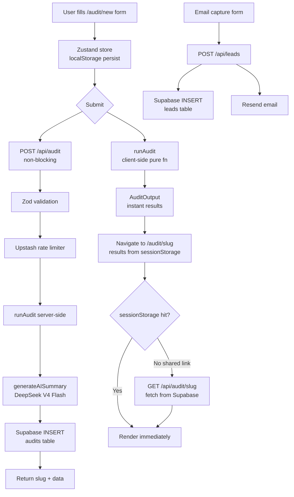

# ARCHITECTURE.md — SpendLens

## System Diagram

---

## Data Flow: Input → Audit Result

1. **User input** — tool name, plan, monthly spend (what they actually pay), seat count. Plus global fields: team size and primary use case.

2. **Client-side engine** — `runAudit(input: AuditInput): AuditOutput` runs synchronously in the browser on form submit. No network call needed. Results are stored in `sessionStorage` keyed by a `crypto.randomUUID()` slug.

3. **Three checks per tool:**
   - **Plan-fit** — compare `monthly_spend / seats` against `PRICING_DATA[tool][plan].per_seat_monthly`. If the team is paying more than the official rate, flag `overspending`. If a cheaper plan covers the same seat count, flag `downgrade`.
   - **Redundancy** — cross-tool check. Cursor + GitHub Copilot both cover inline code completion for coding teams → flag the cheaper one as `redundant`. Claude + ChatGPT for a writing team → flag the more expensive as `switch`.
   - **Verdict assignment** — `optimal` | `downgrade` | `switch` | `redundant` | `overspending`

4. **Totals** — `total_monthly_savings` is the sum of `monthly_savings` across all tools. `projected_annual_savings = total_monthly_savings × 12`.

5. **API persistence (async)** — `POST /api/audit` fires after client-side results are displayed. It re-runs the engine server-side for consistency, calls OpenRouter (DeepSeek) for an AI summary, and inserts to Supabase. Returns the same slug so the URL resolves for shared views.

6. **Shared views** — `/audit/[slug]` checks `sessionStorage` first (owner view, instant). On miss, it calls `GET /api/audit/[slug]` which fetches from Supabase (shared link view).

---

## Why This Stack

| Choice | Reason |
|--------|--------|
| **Next.js 14 App Router** | Server components + API routes in one repo. `generateMetadata` for dynamic OG tags. No separate backend needed. |
| **Zustand + localStorage** | Lightweight. Persist form state without a server round-trip. `persist` middleware handles hydration. |
| **Supabase** | PostgreSQL with a generous free tier. Row-level security ready when needed. The JS client works server-side with the service role key. |
| **DeepSeek V4 Flash (OpenRouter)** | High-performance free-tier model. `max_tokens: 1000` is used to allow reasoning headroom. Per-audit cost: $0 on OpenRouter free tier. |
| **Upstash Redis** | Serverless-compatible rate limiting. No persistent connection needed. Falls back to a no-op if not configured. |
| **Tailwind CSS** | Design token system in config. No CSS file bloat. Purges unused styles in production. |
| **Vercel** | Zero-config Next.js deploy. Edge functions available for rate limiting if Upstash is swapped out. |

---

## What I'd Change at 10,000 Audits/Day

| Problem at scale | Change |
|---|---|
| Supabase free tier connection limits | Move to Supabase Pro or add PgBouncer connection pooling |
| OpenRouter API latency (3-4s) | Stream the response instead of awaiting completion. Use Vercel AI SDK's `streamText` and SSE to the client |
| Single `audits` table with JSONB | Extract `tool_results` to a normalized table for queryability. JSONB works at low volume; joins become necessary for analytics |
| Client-side engine duplication | Publish `audit-engine` as an internal npm package. Currently the engine runs both client and server — fine at this scale, but a shared package prevents drift |
| No queue for AI summary generation | Add a Trigger.dev or Inngest job for AI summary. Currently it's synchronous in the API route — at high volume this would time out Vercel's 10s serverless limit |
| sessionStorage for result caching | Replace with a Redis cache keyed by slug. sessionStorage doesn't work for shared links from different devices |

---

## Graceful Degradation Table

| Service | Missing behaviour |
|---------|-------------------|
| Supabase | Audit runs, results shown from sessionStorage. Shareable links don't persist. |
| OpenRouter API | Template-based summary shown. Indistinguishable to most users. |
| Upstash Redis | Rate limiting disabled (allow all). Acceptable for MVP traffic. |
| Resend | Lead captured in Supabase; confirmation email not sent. |
